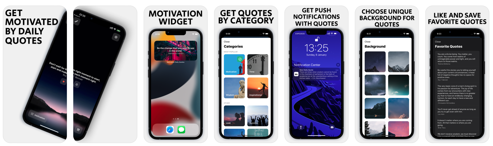

# Motivaton App

IOS app for Daily Motivational Quotes

## Screenshots

## Description

This is an IOS app that I made working on a freelance project. It has Auto-Renewable Subscriptions implemented. Also it has many features that make this app absolutely wonderful. I gained so much experience working on it so I decided to share the code.

### Features
- Amazing Main Page with Scrolling Quotes
- Customization
    - Change the Background Image
    - Change the Category
    - Change the App Icon
    - Change Notifications Time and Conten
- Widget
- In-App Purchases
- Notifications
- Saving the Favorite Quotes
- Sharing Quotes with Friends
- Working absolutely Offline
- Connected Analytics
- Glorious UI and UX
- Lightweight App

## Test App

To be able to use this app and all it's functionality, you need to buy a <a href="https://apps4world.com/in-app-purchases-swift.html">Purchase Kit</a> and connect it to the app. Also create your products (Auto Renewable Subscriptions) in AppStore Connect and add thir IDs in the code of the app. If you dont wanna do all that, in ContentView.swift, set the isPurchased variable to True.

## License

Motivaton App is available under the MIT license. See the LICENSE file for more info.
